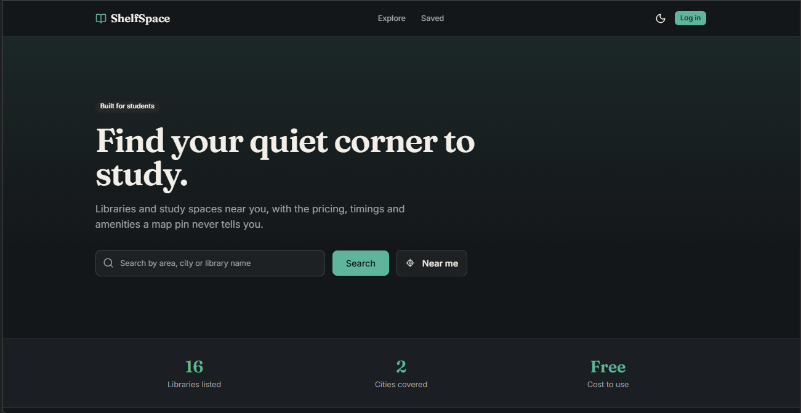
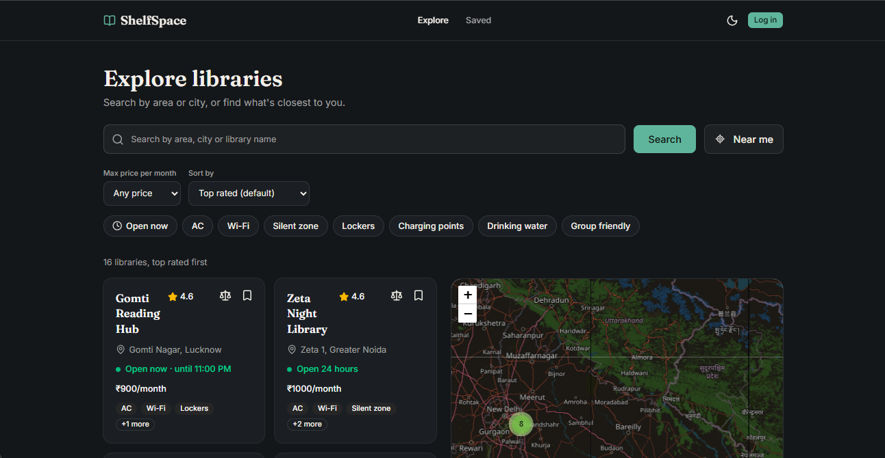
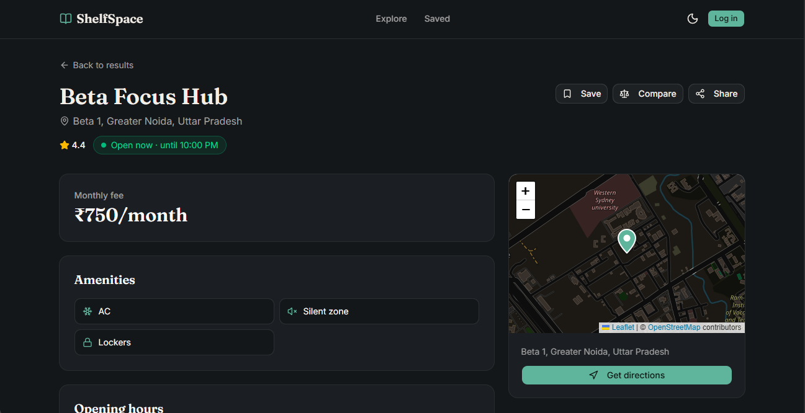
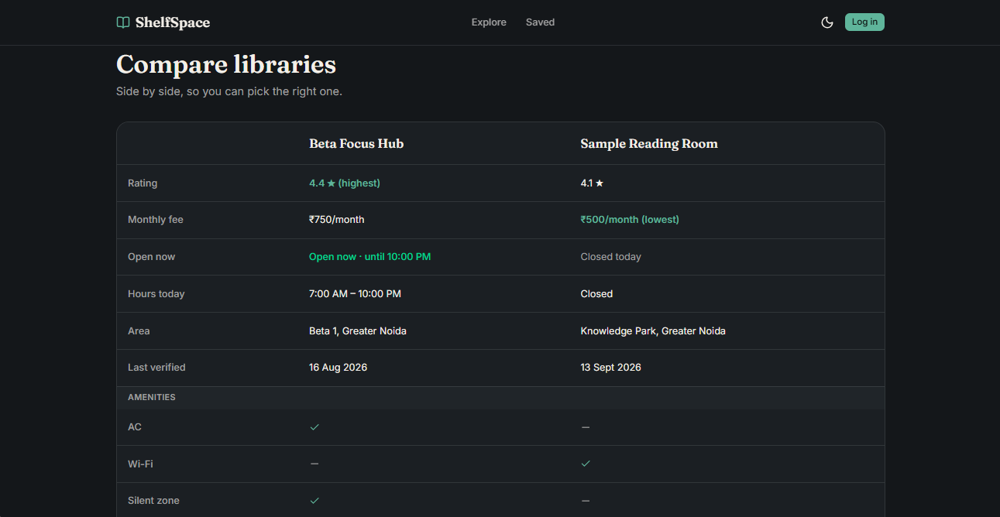

# ShelfSpace

Find libraries and study spaces near you, with the fees, timings and amenities that a map pin never tells you.

**Live demo:** https://shelfspace-v2.vercel.app



> **Status:** the frontend is complete and runs on sample data. The Supabase backend (real data and accounts) is the next phase.

## Why this exists

General directories and maps list every kind of business. For a student looking for somewhere to study, the details that matter, such as the monthly fee, day-wise timings, silent zones and lockers, are often missing or only available by phone. ShelfSpace is a focused finder for exactly that.

## Features

- **Search-first exploring** by name, area or city, with the search kept in the URL so links are shareable and the Back button works
- **Near me:** browser geolocation, distance by the Haversine formula, and a 50 km radius
- **Filters and sorting:** maximum monthly fee, amenities (must match all selected), an **Open now** filter that uses Indian time, and sort by rating, price or distance
- **Interactive map** with clustered pins, side by side with the list on desktop and behind a List/Map toggle on mobile
- **Library detail page:** fee, amenities, day-wise opening hours with today highlighted, a "last verified" date, a mini map and a directions link
- **Save and compare:** bookmark libraries (kept in the browser for now) and compare up to 3 side by side through a shareable URL
- **Login, signup and a Saved dashboard:** validated forms (UI only until the backend is connected)
- **Dark mode, responsive layout, keyboard and screen-reader support,** and custom 404 and error pages

## Screenshots

| Explore with map | Library detail |
|---|---|
|  |  |

| Compare | Mobile filters | Dark mode |
|---|---|---|
|  |  |  |

## Tech stack and why

| Layer | Choice | Why |
|---|---|---|
| Framework | Next.js (App Router) and TypeScript | Server components, file-based routing, and compile-time type safety |
| Styling and UI | Tailwind CSS and shadcn/ui | Accessible components that live in the repo, so they are fully customizable |
| URL state | nuqs | Type-safe search params, so filters are shareable and Back works |
| Forms | React Hook Form and Zod | Uncontrolled inputs for speed, and one schema for rules and types |
| Maps | Leaflet, react-leaflet, react-leaflet-cluster, OpenStreetMap | Free, with no API key or billing |
| Hosting | Vercel | Automatic deploys on every push |

## Architecture highlights

- **Data-access layer** (`src/lib/data`): pages call functions like `searchLibraries()`. Today they read sample data. Connecting Supabase later changes those functions, not the UI.
- **Server-side filtering:** search, filters and sorting are URL parameters read on the server, so the browser downloads less JavaScript and every view is a shareable link.
- **Time-zone-safe "Open now":** servers run in UTC, so opening hours are evaluated in `Asia/Kolkata` with `Intl.DateTimeFormat`, including hours that run past midnight.
- **Honest data:** the UI shows "Not verified yet" when there's no verification date and marks sample listings as sample data. It never claims more than it knows.
- **Accessibility:** skip link, labelled controls, `aria-pressed` toggles, `aria-live` result counts, a keyboard-focusable scrollable table, and reduced-motion support.

## Performance and accessibility

PageSpeed Insights, mobile, production deployment (20 Sep 2026):

| Performance | Accessibility | Best Practices | SEO |
|---|---|---|---|
| 93 | 96 | 100 | 100 |

Total Blocking Time 20 ms and Cumulative Layout Shift 0.

## Getting started

Requires Node.js 20 or newer.

```bash
git clone https://github.com/shubhitiwariiii/shelfspace-v2.git
cd shelfspace-v2
npm install
npm run dev
```

Open http://localhost:3000. For a production build: `npm run build && npm run start`.

## Project structure

```
src/
├── app/                 # routes: explore, library/[id], compare, dashboard, login, signup, api
├── components/          # UI: cards, filters, map, auth forms (ui/ holds shadcn components)
├── lib/                 # data layer, search params, open-now logic, schemas, stores
└── mock/                # sample libraries
docs/screenshots/        # images used in this README
```

## Roadmap

- [ ] Supabase: PostgreSQL, Auth and Row Level Security
- [ ] Idempotent OpenStreetMap ingestion script, with verified data in a separate table
- [ ] Real login, with saved libraries synced per account
- [ ] Reviews, an owner-verification flow and an admin panel
- [ ] Automated tests (Vitest and Playwright)
